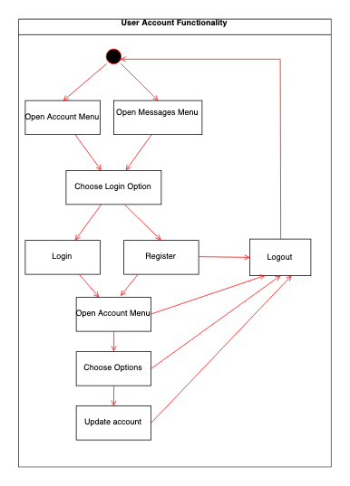
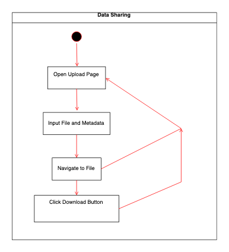
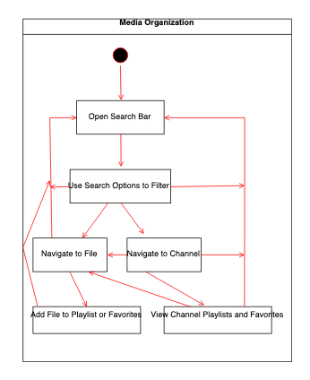
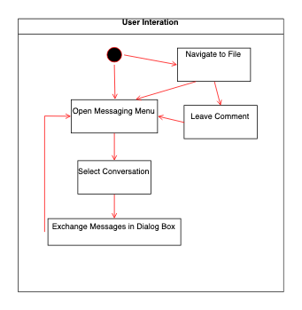

# MeTube Function Design

## Client

### User Account

- Registration: Users can reach the registration page through a link on the sign-in page prompting them to create an account.
- Sign In: Users can reach the sign-in page through the account menu, attempting to open the messages menu while not logged in, or attempting to comment on a file while not logged in.
-  Profile update: Users can update their profile through the account menu by clicking on the "Options" option.
- (Contacts, friend/foe, and user blocking are all implemented in our backend, but not currently available in our UI. Contacts can be added, but the remove contacts functionality is not 100% functional.)

### Data Sharing

- Upload: Users can upload a file if logged in by selecting the upload button on the top app bar. This will redirect them to the upload page.
- Meta data input: - On the upload page, users have the option to input meta data that will be associated with the file they are uploading.
- Download/View: Users can navigate to a file using tools such as the search bar, channels, playlists or the home page. Once on a files page, users can download and view the file.

### Media Organization

- Browse by Category: On the side menu bar, users can browse file organized by type (image, video, text). When searching for files, the search options feature also allows users to specify categories of files they want to search for.
- Channel: Each user has a channel, where their uploaded files and public playlists are visible. The channel, is the equivalent of the user's public profile.
- Playlists: Users can add files to existing playlists or new playlists using the add button that is available under files. Public playlists can then be seen on the user's channel.
- Favorite Lists: Users can add files to their favorites using the add button that is available under files. A user's favorites can then be seen on the user's channel.
- Most viewed: When searching for files, users can organize the files by those with the most views.
- Most recently uploaded: When searching for files, users can organize the files by those with the most recent upload dates.

### User interaction

- Messaging: Users can message their contacts using the message menu available through the top app bar. In the message menu, user's can see and select their most recent conversations to open the message dialog where they can see the entire conversation and exchange messages. Users can add contacts, but navigating to each others channels and using the contact button.
- Commenting: Users can comment on files, by navigating to the file's page and using the comment component available under the file's view.

### Search
- Keywords-based search: Using the search bar to search for files by keyword.
- Feature-based media search: Users can search for files according to different file features using the search options component.

## Server
Our server is split into 13 modules written in Python3
each module handles request and responses to specific file and database
queries

### db.py
1. uses SQLAlchemy to generate a database for the Website
2. provides helper functions for authentication that will be used later

### auth.py
1. provides a route for clients for User authentication by verifying hashed
passwords in the database
2. provides a route for clients to retrieve the administrators in the database
3. provides a route for clients that validates users login request as well as
validates current users authentication status while browsing the site

### categories.py
1. provides a route for clients to get file data from all categories in the
database
2. provides a route for clients to get file data from files in a single category
3. provides a route for clients to set the category of a uploaded files
4. provides a route for clients to delete category information for a file
5. provides a route for clients to edit the category of an existing file
6. provides a route for clients to remove the category of an existing file

### comments.py
1. provides a route for clients to get the comments associated with a file
2. provides a route for clients to add comments to a specified file
3. provides a route for clients to delete a comment from associated file

### keywords.py
1. provides a route for clients to get all keywords in the database
2. provides a route for clients to get a keyword by its keyword id
3. provides a route for clients to add keywords to the database when a file is
uploaded
4. provides a route for clients to delete a keyword by its keyword id
5. provides a route for clients to add keywords to an associated file in the
database
6. provides a route for clients to delete a keyword by its file and keyword ids

### messages.py
1. provides a route for clients to get user messages between users
2. provides a route for clients to update or add messages between
users

### playlist.py
1. provides a route for clients to get all playlists for an associated users
2. provides a route for clients to get a specific playlist by playlist id
3. provides a route for clients to get the files associated with a playlist
by playlist id
4. provides a route for clients to create a playlist
5. provides a route for clients to edit an existing playlist
6. provides a route for clients to delete an existing playlist
7. provides a route for clients to link an existing file to an existing playlist
8. provides a route for clients to unlink a file from an existing playlist

### files.py
1. provides a route for clients to get file information of all files in the
database
2. provides a route for clients to get a specific file by file id
3. provides a route for clients to get a specific files data by file id
4. provides a route for clients to upload a file with meta-data
5. provides a route for clients to edit a files meta-data
6. provides a route for clients to delete a file from the database

### response.py
1. provides helper functions for sending and receiving http request

### server.py
1. provides helper functions for creating and deleting the database
2. registers the other files to be used by the clients
3. provides a route for administrators to delete the database

### user.py
1. provides a route for clients to get all the users in the database
2. provides a route for clients to get a specific users information
3. provides a route for clients to add a user to the database
4. provides a route for clients to edit a users information
5. provides a route for clients to delete a user from the database
6. provides a route for clients to get a users contact lists
7. provides a route for clients to unsubscribe from an other users account
8. provides a route for clients to get all subscribers of a specific user
9. provides a route for clients to add a user to a friend
10. provides a route for clients to add a user to a unfriend
11. provides a route for a clients to block a specified user
12. provides a route for clients to unblock a specified user
13. provides a route for clients to get a users favorites list
14. provides a route for clients to link a favorites list of a user
15. provides a route for clients to unlnk a favorites list of a user

### utils.py
1. sets the parameters for filtering search results

### config.py
1. sets the database variables to access a database
