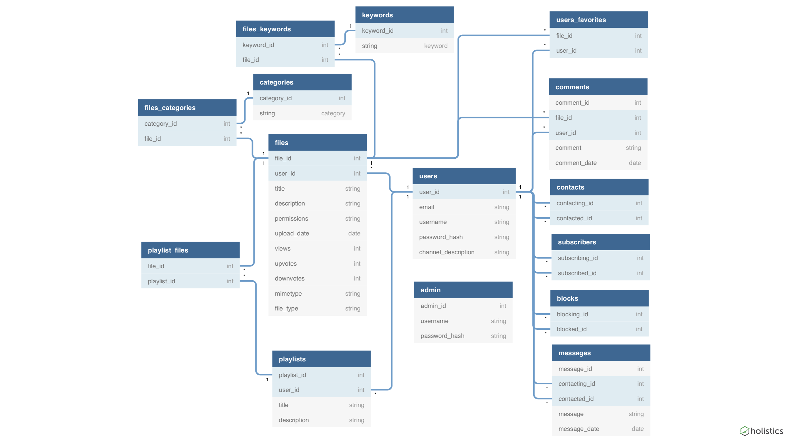
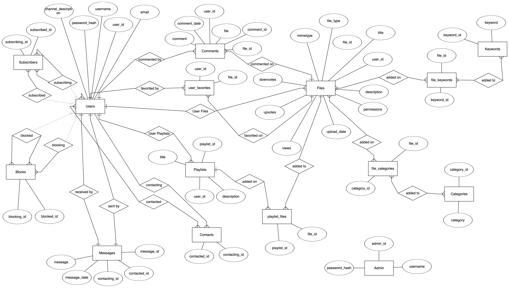
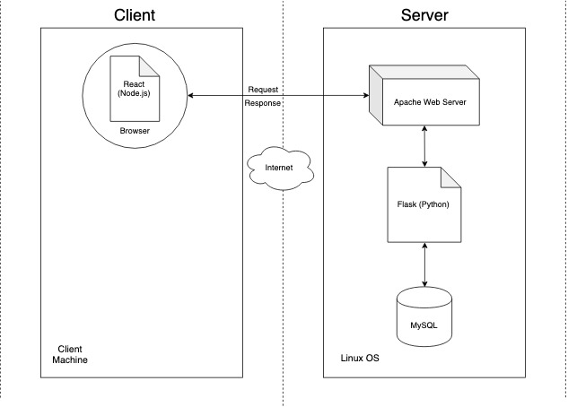

# MeTube System Design

## Introduction
The goal of this project is to develop an online multimedia database system called MeTube that will allow users to share multimedia files.

### Purpose
The purpose of this project is for the student members of our group to gain experience applying the database theories and techniques we have learned this semester to a real world application.

## System Overview
Our application was implemented using Linux, Apache, MySQL database, Flask (Python) API backend, React (NodeJS) front end, and Postman to test our API.

### Design Constraints
The project must be deployed on a Linux system with Apache web server provided by the Clemson School of Computing and tested with both IE and Firefox as the web browser respectively.

### Roles and Responsibilities
Charles Ison, Chelky Lin, and Jacary Richardson are the primary developers of the application.

### Project References
http://flask.pocoo.org/docs/1.0/

https://reactjs.org/docs/design-principles.html

https://nodejs.org/en/docs/guides/

https://httpd.apache.org/

https://dev.mysql.com/doc/refman/8.0/en/

## System Architecture

### Database Design

### Hardware and Software Design

### System Security
Our users' plaintext passwords are hashed before they are stored in our database. Admin accounts exist to monitor that the system is operating properly.
